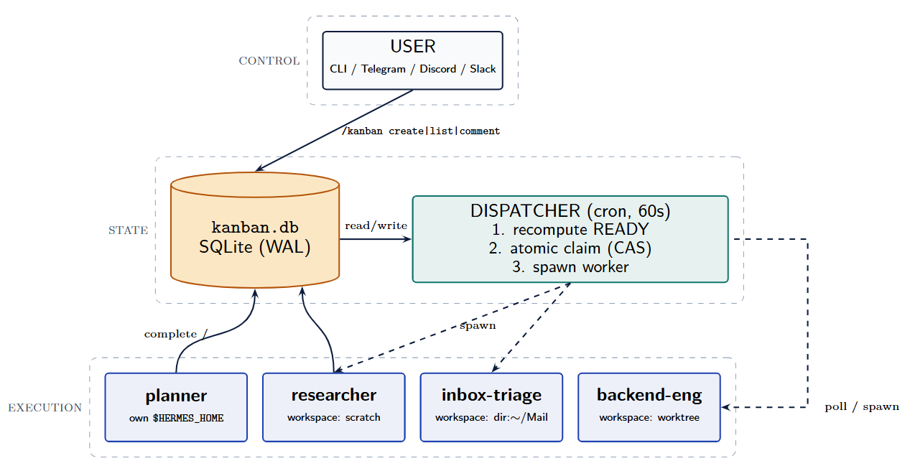

# 模块四：协作篇 — Gateway、Profile、Delegation、Kanban 与高级特性

## 目录

1. [Gateway 消息网关](#1-gateway-消息网关)
2. [Profile 多实例](#2-profile-多实例)
3. [Delegation 任务委派](#3-delegation-任务委派)
4. [Kanban 多 Agent 协作](#4-kanban-多-agent-协作)
5. [高级特性集锦](#5-高级特性集锦)

---

## 1. Gateway 消息网关

> 官方文档：<https://hermes-agent.nousresearch.com/docs/user-guide/messaging/>

Gateway 是 Hermes 的消息平台接入层，可以作为前台进程或后台服务运行。它负责连接 Telegram、Discord、Slack、微信等平台，接收消息，维护每个聊天对应的会话，把消息转发给 Hermes Agent 处理，再把回复发回原平台。

Gateway 和 CLI 模式使用同一套 Hermes 程序、配置、会话、记忆、技能和工具。区别在于：CLI 是终端里的单次交互入口，Gateway 是长期运行的消息平台适配进程。Gateway 还会运行 cron 调度循环，用来触发到期的计划任务。

### 1.1 命令

```bash
hermes gateway setup                 # 交互式配置消息平台
hermes gateway                       # 前台启动 Gateway
hermes gateway install               # 安装为用户服务（Linux）/ launchd 服务（macOS）
sudo hermes gateway install --system # 仅 Linux：安装为开机启动的系统服务
hermes gateway start                 # 启动默认服务
hermes gateway stop                  # 停止默认服务
hermes gateway status                # 查看默认服务状态
hermes gateway status --system       # 仅 Linux：检查系统服务状态
```

#### Telegram Bot 端到端搭建

以 Telegram 为例，完整的 Gateway 接入流程如下：

**步骤 1：创建 Bot**

在 Telegram 中搜索 `@BotFather`，发送 `/newbot`，按提示设置名称和用户名，获得 Bot Token（格式：`1234567890:ABCdefGHIjklMNOpqrsTUVwxyz`）。

**步骤 2：配置 Hermes**

```bash
# 将 Bot Token 写入 .env
echo "TELEGRAM_BOT_TOKEN=1234567890:ABCdefGHIjklMNOpqrsTUVwxyz" >> ~/.hermes/.env

# 交互式配置 Gateway（Telegram 选项）
hermes gateway setup
```

**步骤 3：启动 Gateway**

```bash
# 前台运行（调试用）
hermes gateway

# 安装为系统服务（推荐生产环境）
hermes gateway install
hermes gateway start
```

**步骤 4：验证配对**

首次与 Bot 私信时，Bot 会回复配对码。管理员在本机批准：

```bash
hermes pairing list          # 查看待审批的配对请求
hermes pairing approve telegram XKGH5N7P
```

此后该用户即可与 Hermes 自由对话。

### 1.2 支持的消息平台（23+）

Hermes Gateway 支持 **23 个以上的消息平台**：

Telegram、Discord、Slack、WhatsApp、Signal、DingTalk、SMS (Twilio)、Mattermost、Matrix、Webhook、Email (IMAP/SMTP)、Home Assistant、Feishu/Lark、WeCom、Weixin（微信）、BlueBubbles (iMessage)、QQBot、Yuanbao、IRC、Microsoft Teams、Google Chat、LINE、SimpleX Chat、**ntfy**（v0.15+，无需账号的推送通知）

```
#邮箱配置  .env
EMAIL_PASSWORD=QHaqxxxxxxxxxxxxxxxxxxxxx
EMAIL_IMAP_HOST=imap.163.com
EMAIL_SMTP_HOST=smtp.163.com
EMAIL_SMTP_PORT=465
EMAIL_ADDRESS=yaohm7788@163.com
# Allow all users for testing
EMAIL_ALLOW_ALL_USERS=true

#微信配置 https://hermes-agent.nousresearch.com/docs/zh-Hans/user-guide/messaging/weixin
WEIXIN_ACCOUNT_ID=c94b6aa27d45@im.bot
WEIXIN_TOKEN=c94b6aa27d45@im.bot:06xxxxxxxxxxxxxxxxxxxxx
WEIXIN_BASE_URL=https://ilinkai.weixin.qq.com
WEIXIN_CDN_BASE_URL=https://novac2c.cdn.weixin.qq.com/c2c
WEIXIN_DM_POLICY=pairing
WEIXIN_ALLOW_ALL_USERS=true
WEIXIN_ALLOWED_USERS=
WEIXIN_GROUP_POLICY=disabled
WEIXIN_GROUP_ALLOWED_USERS=
WEIXIN_HOME_CHANNEL=o9cq800SHCEm-xxxxxxxxxxxxxxxxxxxxx@im.wechat
```

### 1.3 网关配对

默认情况下，网关会拒绝所有不在允许列表中或未通过私信配对的用户。

#### 允许列表

在 `~/.hermes/.env` 中配置：

```bash
# 按平台限制用户
TELEGRAM_ALLOWED_USERS=123456789,987654321
WEIXIN_ALLOWED_USERS=123456789,987654321

# 或配置通用允许列表
GATEWAY_ALLOWED_USERS=123456789,987654321

# 显式允许所有用户（不推荐给有终端访问权限的机器人使用）
GATEWAY_ALLOW_ALL_USERS=true
```

#### 私信配对

无需手动配置用户 ID，未知用户在私信机器人时会收到一次性配对码，例如 `Pairing code: XKGH5N7P`。之后管理员在本机批准：

```bash
hermes pairing approve telegram XKGH5N7P  # 批准配对
hermes pairing list                       # 查看配对列表
hermes pairing revoke telegram <user_id>  # 撤销配对
```

配对码 1 小时后过期，有速率限制，并使用加密随机数生成。

#### 斜杠命令权限控制

权限分层只控制斜杠命令，不影响普通聊天。规则：

1. 先判断用户是否被允许使用 Gateway
2. 再判断当前作用域是否启用了命令权限分层
3. 未配置 admin 列表时，所有已允许用户都可以运行斜杠命令
4. 配置了 admin 列表时，管理员可运行所有命令，普通用户只能运行显式允许的命令（以及始终可用的 `/help` 和 `/whoami`）

```yaml
# ~/.hermes/config.yaml
gateway:
  platforms:
    discord:
      extra:
        allow_from: ["111", "222", "333"]
        allow_admin_from: ["111"]
        user_allowed_commands: [status, model]
        group_allow_admin_from: ["111"]
        group_user_allowed_commands: [status]
```

用 `/whoami` 查看当前平台、作用域、权限层级和可运行的斜杠命令。

---

## 2. Profile 多实例

> 官方文档：<https://hermes-agent.nousresearch.com/docs/user-guide/profiles>

通过 Profile 运行多个独立的 Hermes Agent，每个 Agent 有独立的配置、会话、技能和记忆。

### 2.1 什么是 Profile

Profile 是一个独立的 Hermes home 目录。其中包含各自的 `config.yaml`、`.env`、`SOUL.md`、记忆、会话、技能、cron 任务、状态数据库和 Gateway 状态。

通过 Profile 可以运行用于不同用途的 Agent 而不会混淆 Hermes 状态。

创建 Profile 后，Hermes 会自动生成同名命令别名。例如创建 `coder` 后，可以直接使用 `coder chat`、`coder setup`、`coder gateway start`，本质上等价于 `hermes -p coder ...`。

### 2.2 创建 Profile

```bash
hermes profile create coder                     # 创建空白 Profile，内置技能会初始化
hermes profile create coder --description "负责阅读源码、实现已明确的代码修改、修复测试或构建问题、运行必要验证，并在完成后汇报改动、测试结果和剩余风险"
hermes profile create coder --clone             # 克隆当前 Profile 的 config.yaml、.env、SOUL.md
hermes profile create backup --clone-all        # 克隆完整状态
hermes profile create coder --clone --clone-from backup  # 从指定 Profile 克隆
hermes profile describe coder --text "..."      # 为 Profile 添加描述@
hermes profile describe coder --auto            # 用辅助模型自动生成描述
hermes profile delete coder                     # 删除 Profile
```

### 2.3 使用 Profile

```bash
coder chat                                      # 启动 coder profile 的交互式对话
coder setup                                     # 运行 coder profile 的配置向导
coder gateway start                             # 启动 coder profile 的 Gateway 服务
coder doctor                                    # 检查 coder profile 的健康状态
coder skills list                               # 查看已安装的 skills
coder config set model.default anthropic/claude-sonnet-4  # 修改默认模型
```

别名本质上等价于 `hermes -p <name>`。也可以显式指定：`hermes -p coder chat`。

设置默认 Profile：

```bash
hermes profile use coder    # 默认使用 coder Profile
hermes profile use default  # 恢复为 default
```

### 2.4 工作原理

Profile 使用 `HERMES_HOME` 环境变量。运行 `coder chat` 时，包装脚本会在启动 Hermes 前设置 `HERMES_HOME=~/.hermes/profiles/coder`。每个 Profile 都可以作为独立进程运行自己的 Gateway，拥有自己的 bot token。

---

## 3. Delegation 任务委派

> 官方文档：<https://hermes-agent.nousresearch.com/docs/user-guide/features/delegation>

Hermes 可以创建子 Agent 来处理独立的任务。子 Agent 有自己的对话和终端环境，互不干扰。

### 3.1 单任务与并行批量

**单任务：**

```text
delegate_task(
    goal="Debug why tests fail",
    context="Error: assertion in test_foo.py line 42",
    toolsets=["terminal", "file"],
)
```

**并行批量（默认最多 3 并发，可通过 `max_concurrent_children` 调高）：**

```text
delegate_task(tasks=[
    {"goal": "Research topic A", "toolsets": ["web"]},
    {"goal": "Research topic B", "toolsets": ["web"]},
    {"goal": "Fix the build", "toolsets": ["terminal", "file"]},
])
```

超过 `max_concurrent_children` 的批量请求会直接返回工具错误。结果按输入顺序排列。父 Agent 中断会传播到所有活跃子 Agent。

### 3.2 子 Agent 上下文

子 Agent 启动时拥有全新对话，不知道父会话之前的任何内容。唯一上下文来自接收的 `goal` 和 `context` 两个字段：

- `goal`：任务目标（必填）
- `context`：完成目标所需的全部背景信息

子 Agent 完成后，只有结构化摘要回传到父会话，详细对话过程不保留，以此控制 token 开销。

### 3.3 工具集限制

| toolsets | 适用场景 |
|----------|---------|
| `["terminal", "file"]` | 编码、调试、文件编辑 |
| `["web"]` | 调研、查文档 |
| `["terminal", "file", "web"]` | 全栈任务（默认） |

某些工具限制为子 Agent 无法使用：

| 工具 | 原因 |
|------|------|
| `delegation` | 叶子节点禁止再次委派（orchestrator 保留） |
| `clarify` | 子 Agent 不能与用户交互 |
| `memory` | 不写入共享持久记忆 |
| `code_execution` | 子 Agent 应逐步推理 |
| `send_message` | 无跨平台副作用 |

### 3.4 嵌套委派与配置

默认委派是扁平的：父 Agent（深度 0）→ 子 Agent（深度 1，不可再委派）。如需多阶段工作流，需要如下配置：

| 配置项 | 作用 |
|--------|------|
| `role` | `leaf` 是叶子节点，`orchestrator` 申请保留委派能力 |
| `max_spawn_depth` | 全局最大委派深度；`1` 表示只允许一层叶子 Agent |
| `orchestrator_enabled` | 嵌套委派总开关 |

```yaml
# ~/.hermes/config.yaml
delegation:
  max_concurrent_children: 3
  max_spawn_depth: 1
  orchestrator_enabled: true
```

配置交互关系：

| 配置组合 | 结果 |
|---------|------|
| `role="leaf"`，任意 `max_spawn_depth` | 子 Agent 是叶子节点，不能继续委派 |
| `role="orchestrator"`，`max_spawn_depth: 1` | 仍不能继续委派 |
| `role="orchestrator"`，`max_spawn_depth: 2` | 可以再委派一层叶子 Agent |
| `orchestrator_enabled: false` | 全局禁用嵌套委派 |

---

## 4. Kanban 多 Agent 协作

> - 官方文档：<https://hermes-agent.nousresearch.com/docs/user-guide/features/kanban>
> - 架构 PDF：<https://github.com/NousResearch/hermes-agent/blob/main/docs/hermes-kanban-v1-spec.pdf>

Hermes Kanban 是一个多 Agent 协作层：一个可恢复、可审计、可中途介入的工作队列。它把任务、依赖、评论、运行记录和工作目录放进一个持久任务板里，让多个具名 profile 以异步方式协作。

### 4.1 从 delegate_task 到 Kanban

`delegate_task` 适合短的、自包含的推理子任务，但无法覆盖：

1. **研究分流与综合**：多个专家型 Agent 并行产出候选发现，一个或多个审查者选择、合并
2. **定时循环工作流**：日报、周报、小时级收件箱分流等会跨运行积累知识
3. **数字分身 / 持久助手**：具名、长期存在的 Agent 身份在数周或数月里积累记忆
4. **端到端工程流水线**：拆解、并行实现、审查、迭代、提交

Kanban 的目标就是补上这些能力，提供：跨运行持久状态、工作可见性、不同技能 Agent 之间的交接、人类或对等 Agent 随时介入。

### 4.2 架构

三层架构：



- **Control Plane（控制层）**：CLI、Gateway、Dashboard — 用户交互入口
- **State Plane（状态层）**：SQLite board + dispatcher — 唯一事实来源，决定哪些任务可运行
- **Execution Plane（执行层）**：独立 profile worker 进程，每个都有隔离状态

所有协调都通过任务板流转，profile 之间没有直接的进程间通信。

### 4.3 核心概念

#### Board（任务板）

Board 是一个独立的任务队列，拥有自己的 SQLite 数据库、workspaces 目录和调度循环。默认 board 数据库位于 `~/.hermes/kanban.db`。非默认 board 位于 `~/.hermes/kanban/boards/<slug>/`。

#### Task（任务）

Task 是 Kanban 的基本工作单元。一个 task 只有一个 `assignee`，通常是 Hermes profile 名称。

Task 状态：

| 状态 | 说明 |
|------|------|
| `triage` | 待分流 / 待明确 |
| `todo` | 已创建但尚未满足运行条件 |
| `scheduled` | 已暂缓调度，等待恢复 |
| `ready` | 可以被 dispatcher 认领 |
| `running` | worker 正在执行 |
| `blocked` | 需要人工输入或等待外部条件 |
| `review` | 等待审查 |
| `done` | 已完成 |
| `archived` | 已归档 |

**Task 生命周期状态流转**：

```text
                    ┌──────────────┐
                    │   triage     │  ← 粗略想法 / 高层目标
                    └──────┬───────┘
                           │ specify / decompose（自动或手动）
                           ▼
                    ┌──────────────┐
               ┌────│    todo      │  ← 已创建，等待依赖满足
               │    └──────┬───────┘
               │           │ 所有父任务 done/archived
               │           ▼
               │    ┌──────────────┐
               │    │   ready      │  ← 可以被 dispatcher 认领
               │    └──────┬───────┘
               │           │ dispatcher atomic claim
               │           ▼
               │    ┌──────────────┐
               │    │   running    │  ← worker 进程中执行
               │    └──┬───┬───┬───┘
               │       │   │   │
               │       │   │   └──────────┐
               │       │   │              │
               │       ▼   ▼              ▼
               │  ┌────────┐ ┌────────┐ ┌──────────┐
               │  │  done  │ │blocked │ │ crashed/ │ ← 自动恢复或超过重试上限
               │  └────────┘ └───┬────┘ │ timed_out│    进入 blocked
               │       ▲        │      └─────┬─────┘
               │       │   unblock（人工/自动化） │
               │       │        │      ┌────────┘
               │       │        ▼      ▼
               │       │   ┌──────────────┐
               │       └───│   ready       │  ← 重新进入调度队列
               │           └──────────────┘
               │
               ▼
        ┌──────────────┐
        │  archived     │  ← 归档（不再参与调度）
        └──────────────┘
```

关键点：
- `triage` 是入口态，经过 decompose 拆解后变成 `todo` 子任务（原始 triage 变成 root task）
- `todo` → `ready` 由 dispatcher 在每次 tick 中自动推进（检查依赖是否满足）
- `ready` → `running` 通过 SQLite 原子 CAS 更新完成，保证并发安全
- `running` 结束后进入 `done`（正常完成）或 `blocked`（需要人工介入）
- `blocked` 经 `unblock` 后回到 `ready`，重新进入调度队列
- 崩溃/超时任务由 dispatcher 的 stale recovery 自动回收

关键字段包括 `title`、`body`、`assignee`、`priority`、`workspace_kind`、`workspace_path`、`claim_lock`、`consecutive_failures`、`max_retries` 等。

#### Link（任务依赖）

Link 是 task 之间的父子依赖（`parent_id -> child_id`）。父任务完成之前，子任务保持在 `todo`；所有父任务完成（`done`/`archived`）后，dispatcher 推进子任务到 `ready`。支持 fan-out 和 fan-in。

#### Comment（评论 / 交接记录）

Comment 是人类和 Agent 在 task 上追加的持久消息，也是 Kanban 的跨 Agent 交接协议。Worker 启动时会读取完整评论串。人类可通过评论补充要求，Agent 可留下中间发现或交接说明。

#### Event（任务事件）

Event 是 Kanban 的审计日志，记录 task 生命周期里的状态变化、人工编辑和 worker 执行遥测。常见事件：

- **生命周期**：`created`、`promoted`、`claimed`、`completed`、`blocked`、`unblocked`、`archived`
- **人工编辑**：`assigned`、`edited`、`reprioritized`、`status`
- **遥测**：`spawned`、`heartbeat`、`reclaimed`、`crashed`、`timed_out`、`stale`、`gave_up`

#### Workspace（工作目录）

Task 绑定的工作目录，worker 执行时所在位置。

- `scratch`：默认模式，为 task 创建新的临时工作目录
- `dir:<path>`：使用已有绝对路径
- `worktree`：为代码任务创建 git worktree

### 4.4 协作模式

Kanban 可衍生出 6 种可重用协作模式：

| 模式 | 说明 | 典型场景 |
|------|------|---------|
| **Fan-out（扇出）** | 一个目标拆成多个同级 task，并行执行 | 多角度研究、并行实现 |
| **Pipeline（流水线）** | 上游完成 → 下游启动，阶段式传递 | researcher → analyst → writer → reviewer |
| **Fan-in（扇入）** | 多个 task 汇总到一个聚合 task | 研究综合、方案评审 |
| **Long-running journal** | 同一 profile 通过定时任务在共享 workspace 反复处理 | 日报、周报、监控巡检 |
| **Human-in-the-loop** | worker 阻塞 → 人工评论 → unblock → 重新启动 | 不确定决策、需要审批 |
| **Fleet farming** | 一个 profile 管理 N 个对象，每个对象独立 workspace | 多账号管理、多服务器巡检 |

### 4.5 Dispatcher 调度器

Dispatcher 是一个长期循环，默认运行在 Gateway 内部。每 N 秒（默认 60 秒）扫描 board，执行四类动作：

1. **stale recovery**：处理异常的 `running` 任务（认领过期、进程退出、超时）
2. **recompute ready**：推进依赖满足的任务到 `ready`
3. **atomic claim**：通过"比较并交换"式 SQL 更新认领任务
4. **启动 worker**：认领成功后启动 assignee 对应的 profile worker

核心并发语义：

```sql
UPDATE tasks
   SET status = 'running',
       claim_lock = ?,
       claim_expires = ?
 WHERE id = ?
   AND status = 'ready'
   AND claim_lock IS NULL;
```

更新命中 1 行 = 认领成功；命中 0 行 = 已被其他调度器认领。

失败与恢复：连续失败超过重试上限后，任务自动进入 `blocked`，等待人类介入。

```
# 1. 初始化看板（如果还没创建）
hermes kanban init

# 2. 创建一条演示任务
hermes kanban create '阅读 Hermes Agent 文档并小结,永久保存到桌面' --body '重点看 agent loop、skills、gateway 三个部分' --assignee default

# 3. 查看任务
hermes kanban list

# 4. 看某条任务的详情
hermes kanban show <task_id>

# 5. Worker 认领任务（会打印工作目录）
hermes kanban claim <task_id>

# 6. 再启动task
hermes kanban unblock  <task_id>
```

### 4.6 Orchestrator Profile

Kanban 把编排分成两个阶段：

1. **Decomposer 处理 `triage` task**：判断目标是否需要拆分、创建子任务图、写入 assignee 和依赖关系
2. **Orchestrator profile 承接 root task**：子任务完成后，汇总结果，判断总目标是否完成

Orchestrator profile 的职责是协调，不是执行。推荐约束：

1. **禁用执行型工具**：只保留 `kanban`、`memory`，必要时加 `messaging`
2. **加载 `kanban-orchestrator` skill**：注入"你是编排者不是执行者"的行为约束
3. **基于真实 profile 路由**：根据本机 profile 的 description 路由任务

创建 orchestrator profile：

```bash
hermes profile create orchestrator --clone \
  --description "Kanban 编排者。负责拆解高层目标、创建任务、指派真实存在的 profile、建立依赖关系、汇总下游结果；不直接执行研究、写作、编码或运维任务。"

orchestrator tools disable terminal file web browser code_execution

hermes config set kanban.orchestrator_profile orchestrator
hermes config set kanban.auto_decompose true
```

### 4.7 Multi-Tenant Context

`tenant` 是 task 上的可选命名空间，让同一个 profile 服务多个业务上下文。

```bash
hermes kanban create "monthly report" \
  --assignee researcher \
  --tenant business-a \
  --workspace dir:/home/user/tenants/business-a/data/
```

Tenant 主要影响 Workspace、记忆（命名约定）、Board 过滤和审计。Tenant 是软隔离，不是安全边界。

### 4.8 命令工具

```bash
hermes kanban init                                   # 幂等创建 kanban.db
hermes kanban create "research Hermes Agent" --assignee researcher
hermes kanban list [--mine] [--assignee P] [--status S] [--tenant T]
hermes kanban show <id>
hermes kanban assign <id> <profile>
hermes kanban link <parent_id> <child_id>
hermes kanban comment <id> "<text>"
hermes kanban complete <id> [--result "..."] [--summary "..."]
hermes kanban block <id> "<reason>"
hermes kanban unblock <id>
hermes kanban archive <id>
hermes kanban watch [--assignee P] [--kinds completed,blocked,...]
hermes kanban tail <id>
hermes kanban stats
hermes kanban dispatch [--dry-run] [--max N]
hermes kanban swarm <prompt>                         # v0.15+
hermes kanban boards list
hermes kanban boards create <slug> --name "Display Name"
hermes kanban boards switch <slug>
hermes kanban boards rm <slug>                       # 归档
hermes kanban boards rm <slug> --delete              # 硬删除
hermes kanban decompose <id>                         # 把 triage task 拆成子任务图
hermes kanban specify <id>                           # 补全 triage task 成明确 spec
hermes kanban gc                                     # 清理归档 task 的 scratch workspace
```

所有命令也支持 `/kanban` 斜杠形式在会话内使用。

```
hermes kanban swarm "研究 Hermes Agent 的架构并写一份分析报告,输出到桌面" \
  --worker "default:Agent Loop 分析" \
  --worker "default:Skills 系统分析" \
  --worker "default:Gateway 架构分析" \
  --verifier default \
  --synthesizer default
```

