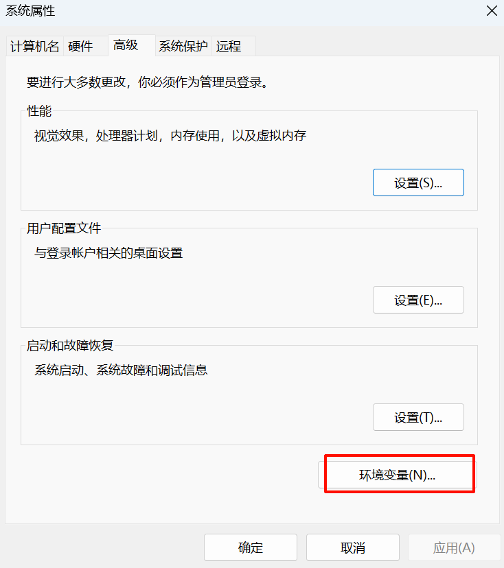
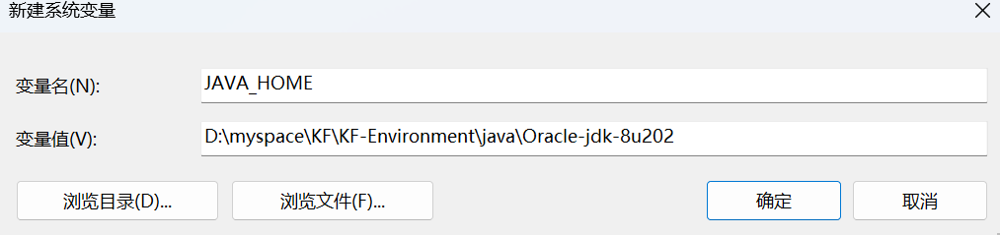
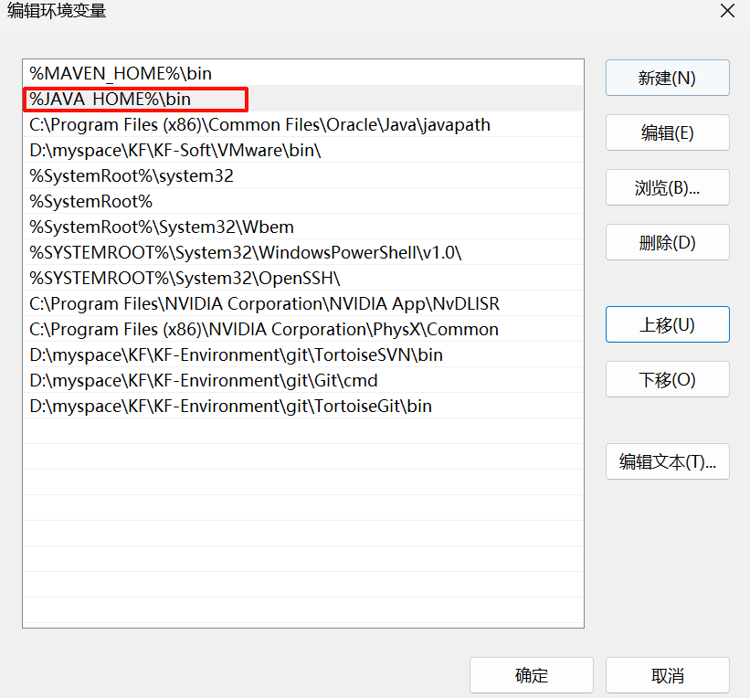

# 下载地址
## oracle
>　官网下载地址：[Java Downloads \| Oracle 中国](https://www.oracle.com/cn/java/technologies/downloads/#java17-windows)
>　官网历史版本下载地址：[Java Archive \| Oracle](https://www.oracle.com/java/technologies/downloads/archive/)


## openjdk
> 下载地址：[Latest Releases \| Adoptium](https://adoptium.net/zh-CN/temurin/releases)

# 设置环境变量
打开高级系统设置

打开环境变量

编辑系统变量，目标path

增加系统变量
```
JAVA_HOME
```

path 增加 并上移到最前面
```
%JAVA_HOME%\bin
```

验证：
执行命令
```sh
java -version
```


