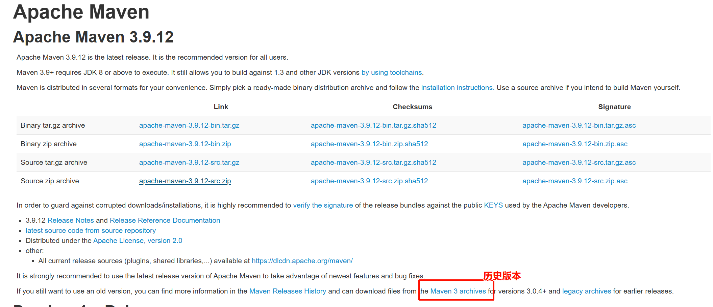
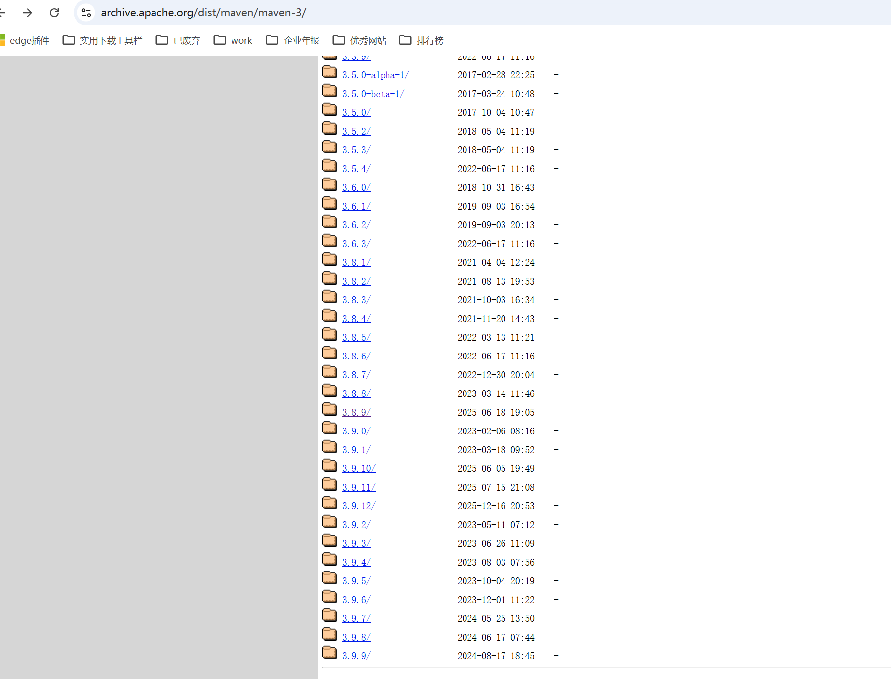
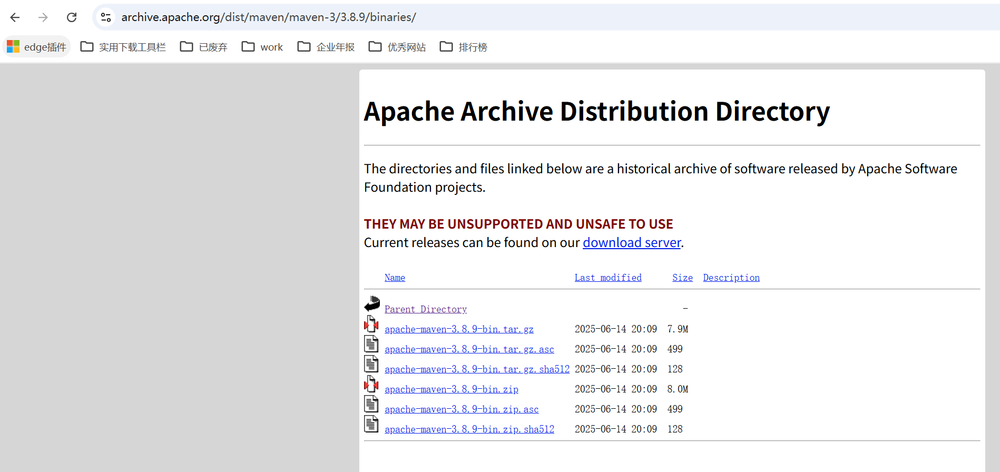
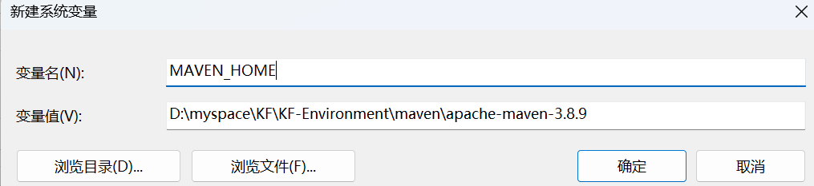
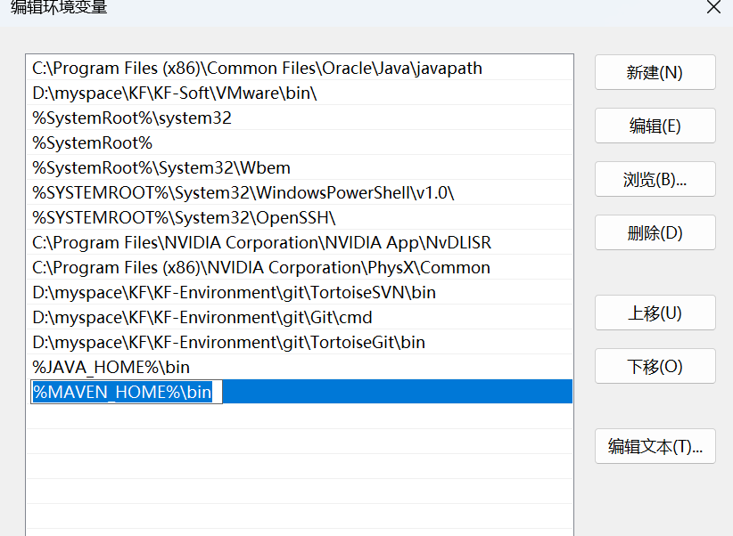

#maven #mvn 
## 官网下载 
>官网下载地址：[Download Apache Maven – Maven](https://maven.apache.org/download.cgi)
>maven历史版本下载入口： [Apache Archive Distribution Directory](https://archive.apache.org/dist/maven/maven-3/)

历史版本入口


查找对应版本地址


## 设置本地仓库地址
conf/settings.xml: (地址自定义，文中以D:\myspace\KF\KF-Environment\maven\repo 为例)
```xml
    <localRepository>D:\myspace\KF\KF-Environment\maven\repo</localRepository>
```

## 修改镜像地址
conf/settings.xml:
```xml
<mirrors>
	<mirror>
        <id>aliyunmaven</id>
        <name>阿里云公共仓库</name>
        <url>https://maven.aliyun.com/repository/public</url>
        <mirrorOf>central</mirrorOf>
    </mirror>
	<!-- 华为公共仓库 -->
	<mirror>
		<id>huaweicloud</id>
		<url>https://mirrors.huaweicloud.com/repository/maven/</url>
		<mirrorOf>*</mirrorOf>
	</mirror>
</mirrors>
```
## 配置环境变量
打开高级系统设置

打开环境变量

编辑系统变量，目标path

增加系统变量
```
MAVEN_HOME
```
path 增加 并上移到最前面
```
%MAVEN_HOME%\bin
```

验证：
执行命令
```sh
mvn -v
```
