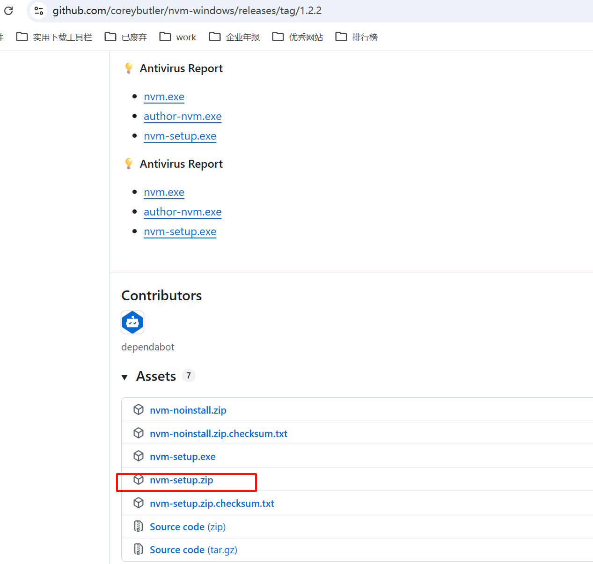

#nodejs #nvm
>nvm是node的版本管理工具，可以方便地安装&切换不同版本的node
## 下载
> 官网下载地址： [GitHub - coreybutler/nvm-windows: A node.js version management utility for Windows. Ironically written in Go.](https://github.com/coreybutler/nvm-windows)

## 安装
解压zip ,执行exe

## 检查安装是否成功

```
nvm -v 
nvm install 12.16.3 
nvm ls 
nvm current 
nvm use 12.16.3 
node -v
```


