#python 

## 关键字

## 变量
```python
age = 10
```
常量(约定，使用全大写表示常量)
```python
AGE = 10
```
## 注释
单行注释： #
多行注释： 三个引号
```python
"""
多行注释 也是字符串，无变量使用解释器会员忽略
"""
'''
这个也是多行注释
'''

#单行注释

```
## 数据类型

- type() 函数可以查数据类型
```python
print(type("你好"))
#返回： <class 'str'>
```
- 整数
可以三位一组用下划线隔开
```python
xx = 10_000_00  
print(xx)
```
- 浮点数
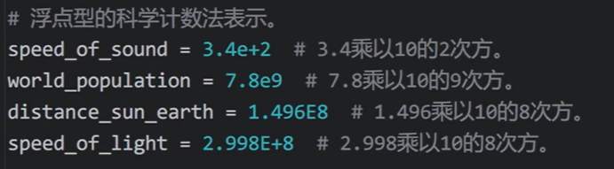
- 字符串

 %s %d %f
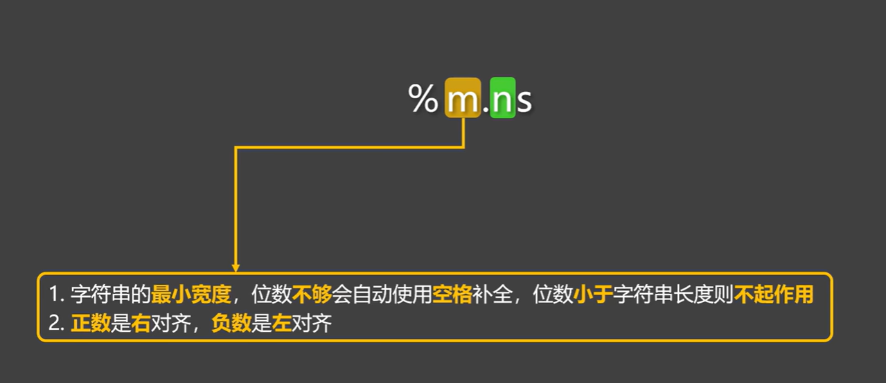
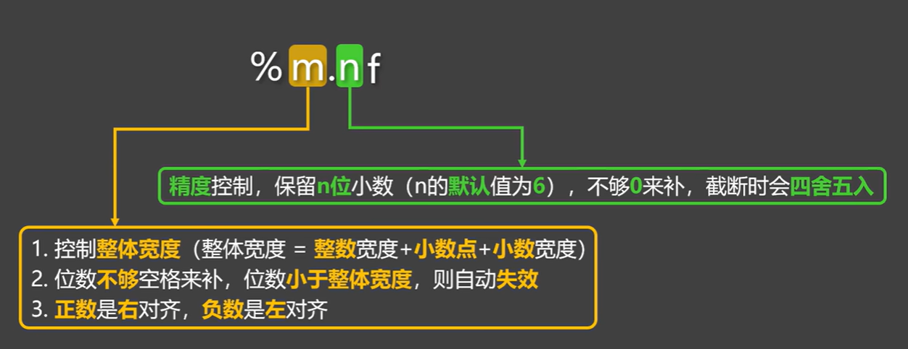

- 数据类型转换
```python
print(type(str(1_000)))  
print(int(56.123))  
print(float(120))  
print(bool(0)) #布尔类型
#返回
<class 'str'>
56
120.0
False
```
## 运算符
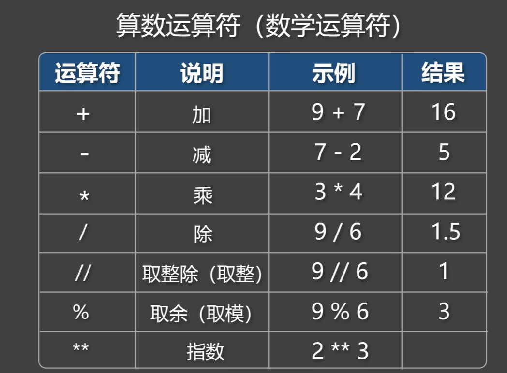

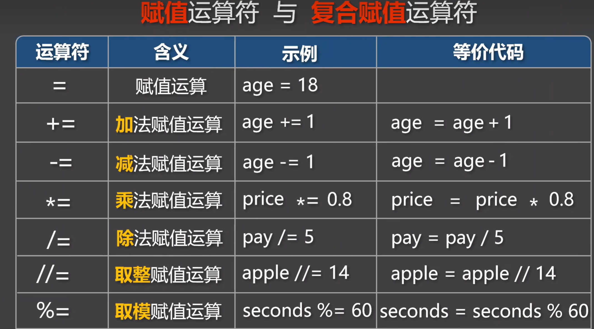

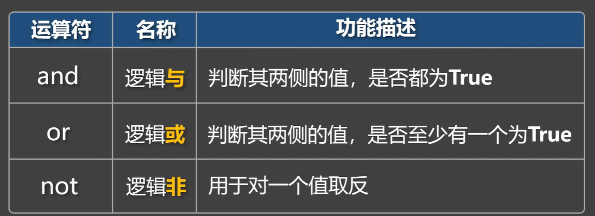

or同理
not 返回一定是布尔值

| 类别       | 示例                        | 布尔值 (bool) |
| -------- | ------------------------- | ---------- |
| **空值**   | `None`                    | False      |
| **假布尔**  | `False`                   | False      |
| **零值**   | `0`, `0.0`, `0j`          | False      |
| **空容器**  | `[]`, `{}`, `()`, `set()` | False      |
| **空字符串** | `""`                      | **False**  |

## 常用函数
### input()

### 字符串函数

^ef1117

string.split(string) 分割返回为列表

string.strip(string) 去除首尾包含的字符字符
len(string) 长度
max(string) 返回unicode编码最大的字符 [min,max特殊用法](Python学习.md#^635307)
min(string) 返回unicode编码最小的字符 [min,max特殊用法](Python学习.md#^635307)
sort(string) unicode编码排序后返回


## 流程判断
### 判断
if-elif-else
```python
num = int(input("班上有多少人: "))  
if if 0 < num < 10::  # 相当 num>0 and num<10 简写
    print("小班")  #4个空格的缩进
elif 20 > num > 10:  # 相当 num<20 and num >10 简写
    print("中班")  #4个空格的缩进
else:  
    print(f"既不是小班也不是中班，班级人数去掉老师是{num-1}人,你自己看吧")
```
条件表达式

### 循环
#### while
```python
n = 1  
while n<10:  
    n+=1  
    print(f"n= {n}")  
print(f"end while , n= {n}")
```
#### for
> 可以使用 continue  , break

```python
#使用range
for n in range(1,5): #range 左闭右开[1,5) 相当于[1,2,3,4]  
    print(f"n = {n}")  
print("end for ")

#字符串也可用for
for n in "abcdee": #相当于[a,b,c,d,e,e]  
    print(f"n = {n}")  
print("end for ")
```
#### 迭代器
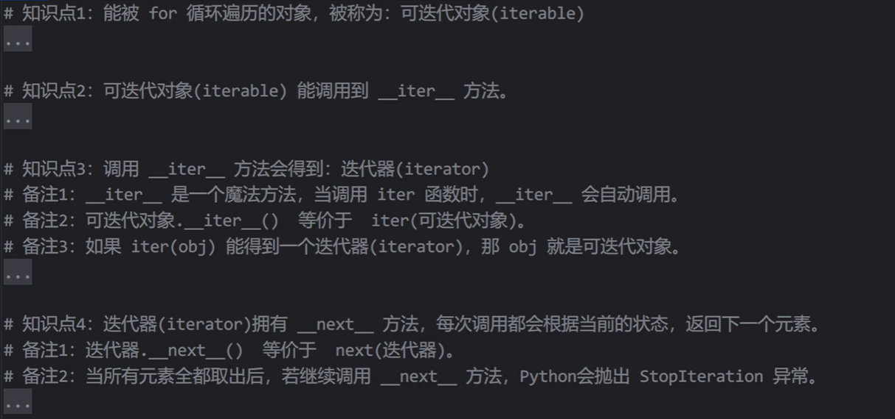

##### 手写迭代器
只要存在_iter_ 和_next_ 方法就是迭代器 
方式一：
```python
class Person:  
    def __init__(self, name, age, sex, heigh, weigh):  
        self.name = name  
        self.age = age  
        self.sex = sex  
        self.heigh = heigh  
        self.weigh = weigh  
  
    def __iter__(self):  
        return PersonIterator(self)  
  
#迭代器
class PersonIterator:  
    def __init__(self, person):  
        self.person = person  
        self.__index = 0  
        # self.__attrs = [person.name, person.age, person.sex, person.heigh, person.weigh]  
        self.__attrs = list(p.__dict__.values())  
  
    def __next__(self):  
        if self.__index >= len(self.__attrs):  
            raise StopIteration  
        else:  
            value = self.__attrs[self.__index]  
            self.__index += 1  
            return value  
  
p = Person("战三", 16, '男', 170, 180)  
for e in p:  
    print(e)
```
方式二: 
```python
class Person:  
    def __init__(self, name, age, sex, heigh, weigh):  
        self.name = name  
        self.age = age  
        self.sex = sex  
        self.heigh = heigh  
        self.weigh = weigh  
        self.__index = 0  
        # self.__attrs = [person.name, person.age, person.sex, person.heigh, person.weigh]  
        self.__attrs = list(self.__dict__.values())  
  
    def __iter__(self):  
        self.__index = 0  
        return self  
  
    def __next__(self):  
        if self.__index >= len(self.__attrs):  
            raise StopIteration  
        else:  
            value = self.__attrs[self.__index]  
            self.__index += 1  
            return value  
  
p = Person("战三", 16, '男', 170, 180)  
for e in p:  
    print(e)
```
方式三 使用生成器
```python
# yield 
class Person:  
    def __init__(self, name, age, sex, heigh, weigh):  
        self.name = name  
        self.age = age  
        self.sex = sex  
        self.heigh = heigh  
        self.weigh = weigh  
        self.__index = 0  
        # self.__attrs = [person.name, person.age, person.sex, person.heigh, person.weigh]  
        self.__attrs = list(self.__dict__.values())  
  
    def __iter__(self):  
       yield self.name  
       yield self.age  
       yield self.sex  
       yield self.heigh  
       yield self.weigh  
  
  
  
p = Person("战三", 16, '男', 170, 180)  
for e in p:  
    print(e)
    
# yield from
class Person:  
    def __init__(self, name, age, sex, heigh, weigh):  
        self.name = name  
        self.age = age  
        self.sex = sex  
        self.heigh = heigh  
        self.weigh = weigh  
        self.__index = 0  
        # self.__attrs = [person.name, person.age, person.sex, person.heigh, person.weigh]  
        self.__attrs = list(self.__dict__.values())  
  
    def __iter__(self):  
        yield from self.__attrs  
  
  
  
p = Person("战三", 16, '男', 170, 180)  
for e in p:  
    print(e)
```
###### 生成器
> 特殊的迭代器

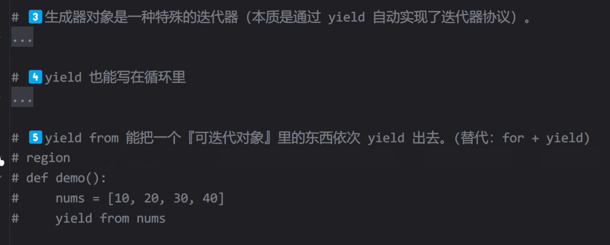

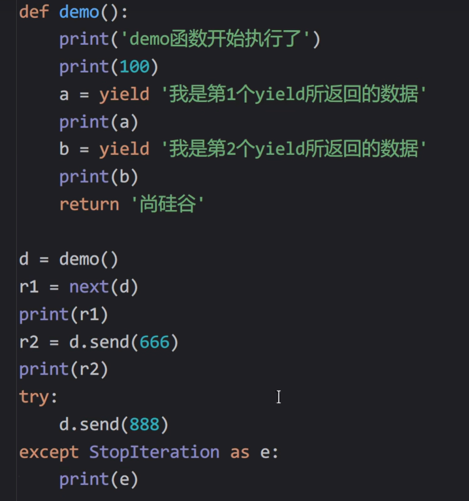
生成器表达式


## 函数

```python
def sumAges(name, needAddAge, age, sex="男",*agrs):  #可变参数(*agrs)相当java ...
    if age < 20:  
  
        print(f"姓名{name},年龄小于20，加年龄{needAddAge}，性别是{sex}")  
        print(agrs)  
        return needAddAge + age  
    elif age > 100:  
        print(f"姓名{name},年龄大于20，不真实，返回none，性别是{sex}")  
        return None  
    else:  
        print(f"姓名{name},年龄在20-100，成年人，不加年龄，性别是{sex}")  
        return age  
  
print(sumAges("张三",1,10,"NI","Hao","python"))  
print(sumAges("老李", 1, 20, sex="女"))  
print(sumAges("老了", 2, 1000,"男","NI","Hao","python"))
```

## 作用域
局部作用域 需要 改变全局作用域的值是，需要声明改的是全局作用域
```python
s = 100  
def printa2b():  
    global s  
    s = 200  
    print(s)  
printa2b()  
print(s)
```
#### 闭包

## 数据容器
> 存放一个个元素的地方

### 常用方法

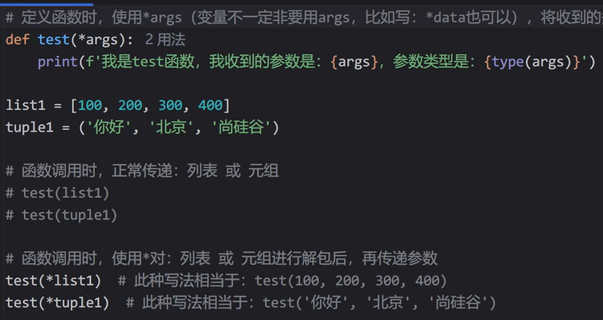
#### sum()
in
not in 
count(item) 计数
### 列表（list）
类似 list集合 和数组
格式： [a,b,c,[aa,bb,cc],d] 
有下标，从0开始 
```python
list = ["a","b",["aa","bb"],"c"]  
print(list[2][1])
```
#### 操作方法
##### 增

##### 删

##### 改
a[0] = 1
##### 查
a[0]
#### 常用方法
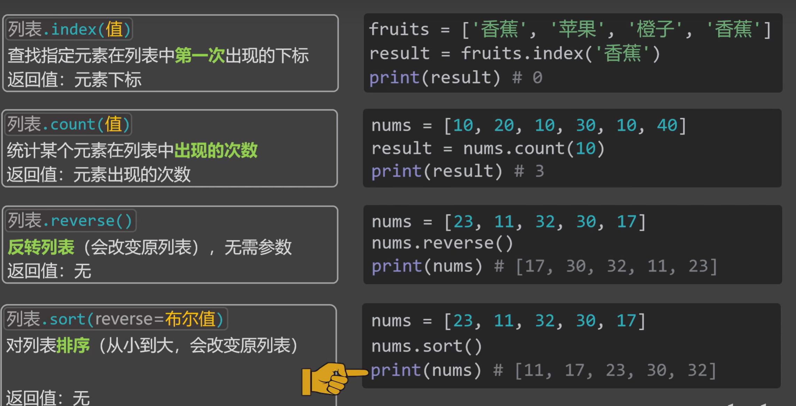
#### 转换

### 元祖
> 元祖数据不可修改 
> 格式 （a,b,c）


#### 转换

### string
[字符串函数](Python学习.md#^ef1117)
#### 转换
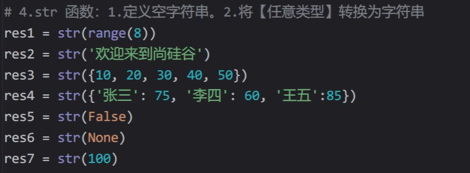

### 序列
列表，元祖，string 都是序列
切片 就是取序列里的一部分元素
```python
# [起始元素，结束元素，步长] 左闭右开 可省略写 如list[:99:] list[1::] list[::1]
list = [1,2,3,4,5,6,7,8,9]  
print(list[2:8:2])
#返回 [3, 5, 7]
```
相加
```python 
list = [1,2,3]  
list2 = [4,5,6,7,8,9]
list3 = list + list2
#返回 [1, 2, 3, 4, 5, 6, 7, 8, 9]
```
相乘（重复添加）
```python
list = [1,2,3]    
list3 = list * 2  
print(list3)
#返回 [1, 2, 3, 1, 2, 3]
```

### 集合
无序，去重
格式： {}
frozenset 是不可变的
```python
set = frozenset("strings")  
print(set)
```
空集合
```python
a = set()
```

#### 操作方法


#### 常用方法

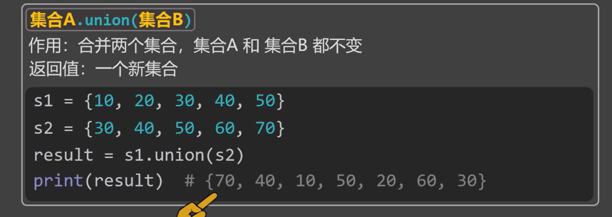


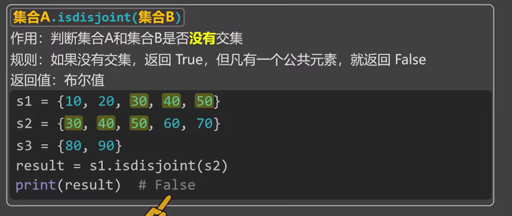

#### 转换

#### 简写
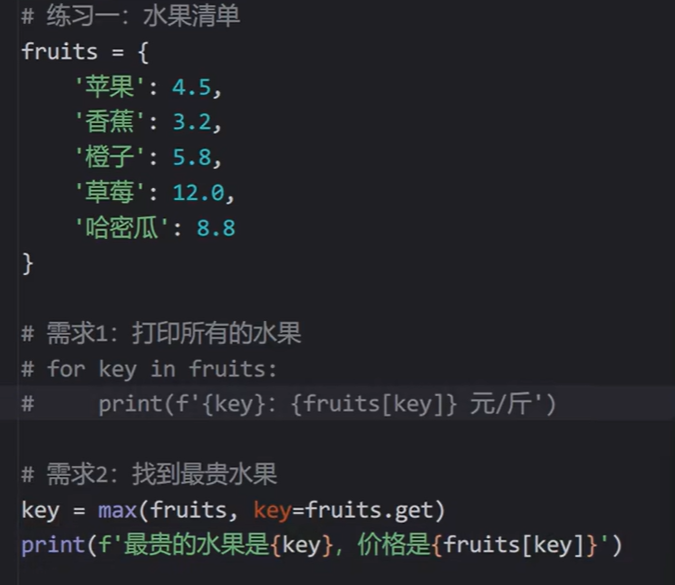
### 字典
类似map ,key有去重能力
key 不可变类型，可以是序列和集合 ,value 任意类型
格式：{key:value,key,value}
#### 操作方法

#### 常用方法
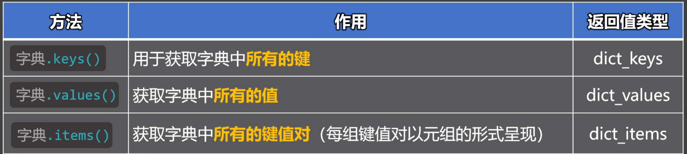
#### 字典遍历
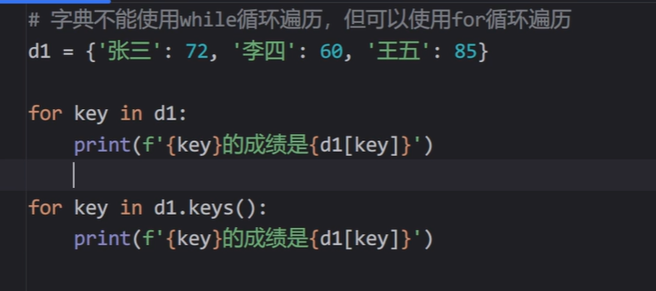
#### 转换
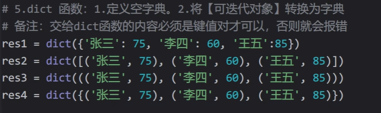
## 面向对象
#### 创建对象
##### 实例对象
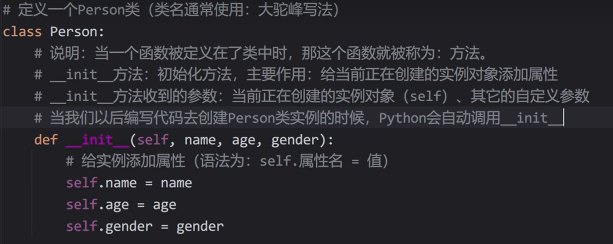
##### 类属性
```python
class Person:
	age = 10 #类属性
	sex = '男' #类属性
```
##### 访问权限
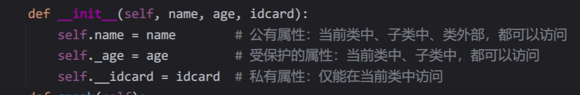
#### 实例化对象
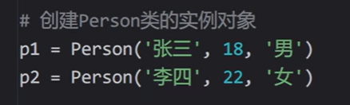
> 对象可以动态添加属性
```python
p1.xxx = "新增的属性xxx"
```
#### 获取和修改对象
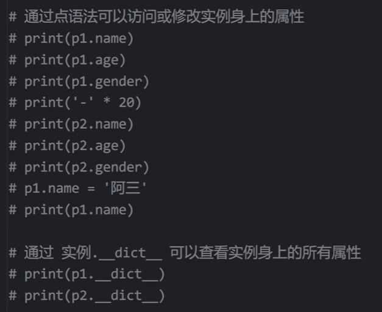
#### 创建方法

### 抽象类


##### 实例方法
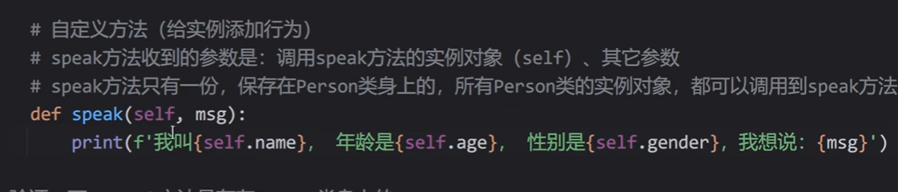
调用
```python
p1 = Persion("张三",15,'男')
p1.speak("hello")
Persion.speak(p1,"hello")
```
##### 类方法
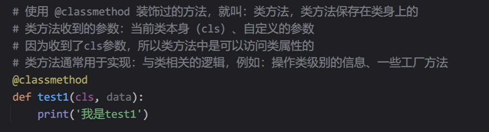
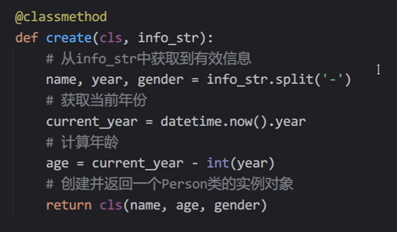
cls 可以使用类属性
##### 静态方法
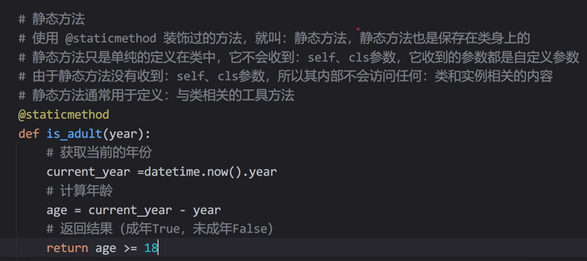
##### getter 和 setter
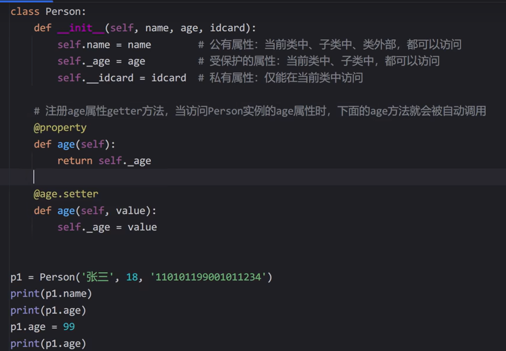
##### 带下划线的方法
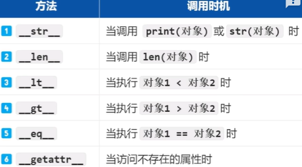
##### 方法可以动态添加属性

##### 方法可以赋值给变量

##### 方法可以作为参数

##### 方法可以作为返回值
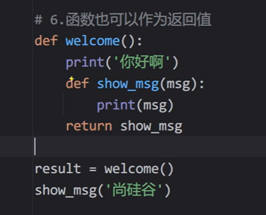
##### 方法有多个返回值，默认返回元组
如返回的是（res1,res2）
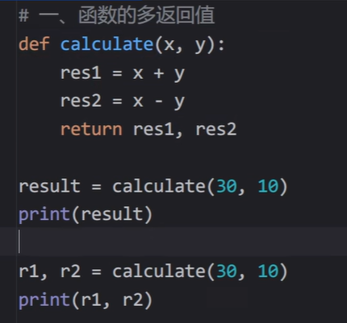
##### 参数打包和解包
打包
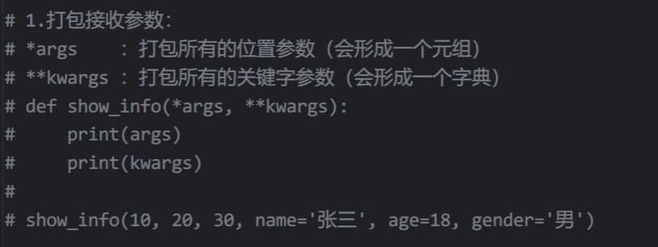
解包

同时使用

##### 匿名函数

##### map函数
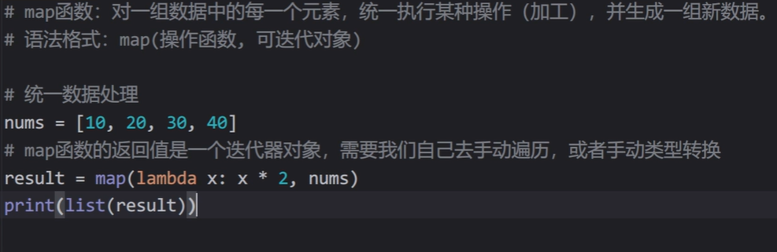
##### Fliter函数
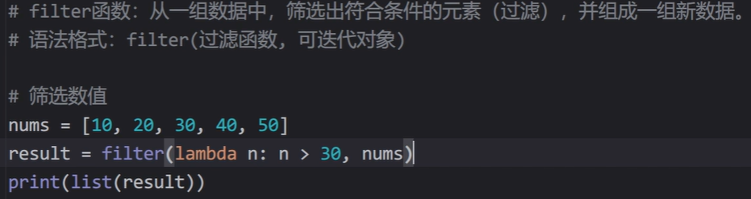
##### sorted函数


##### min,max函数

^635307


##### 推导式（列表，字典，集合）


### 继承
##### 格式
无自己的东西

有自己的东西
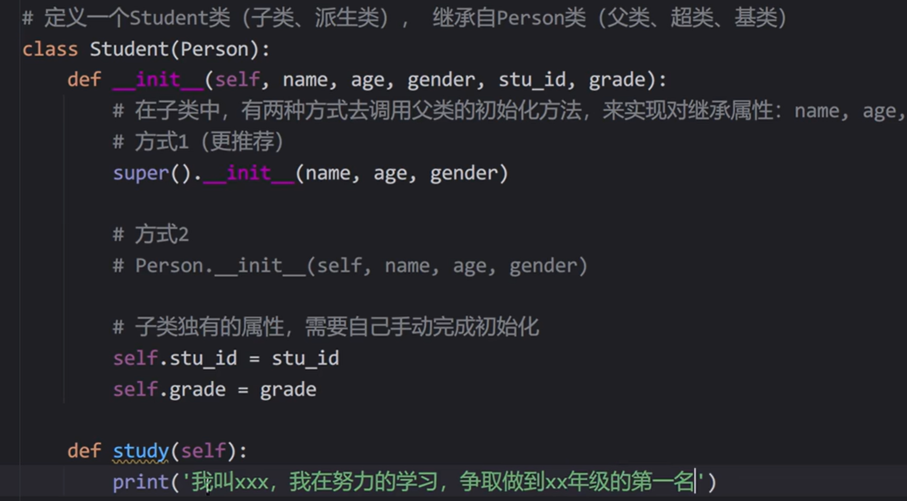
##### 子父类判断
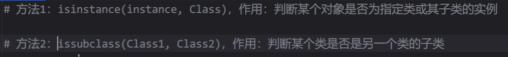
##### 多继承
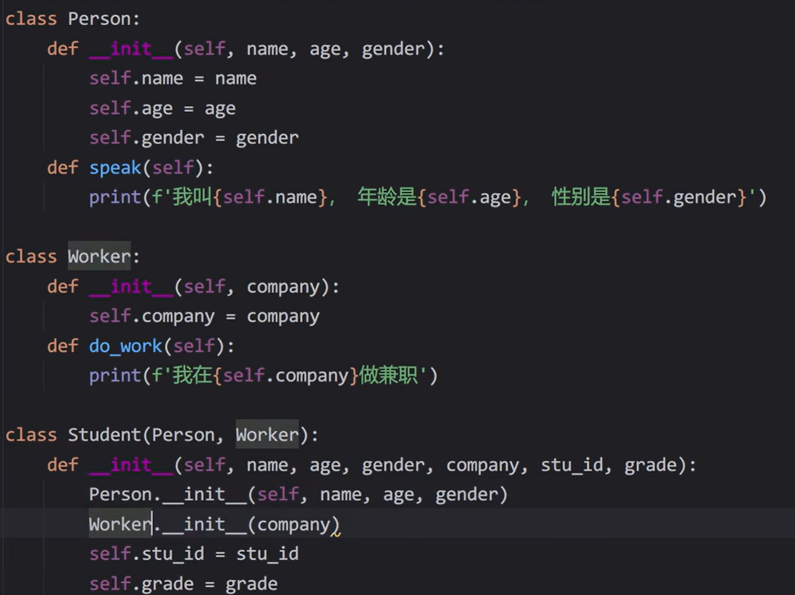

### 多态
#### 标准多态
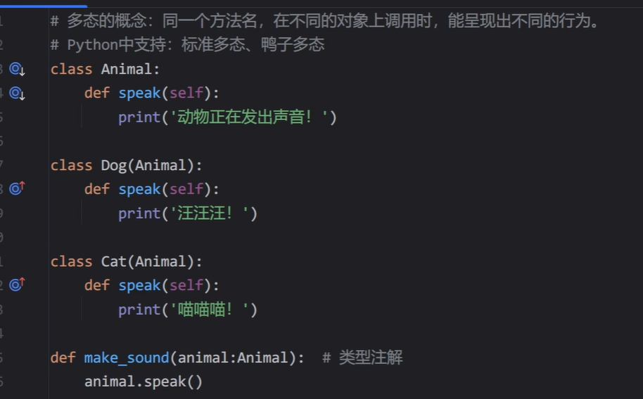
#### 鸭子多态
标准多态基础上，无继承，不需要类型限制，只要同一个方法就可以如speak
## 装饰器
### 函数装饰器
>装饰器:
>1.装饰器是一种可调用对象(通常是函数)，它能接收一个函数作为参数，并且会返回一个新函数。
>2.装饰器可以在不修改原函数代码的前提下，增强或改变原函数的功能。
```python
def add(x,y,z=0):  
    print("add开始执行")  
    c = x+y+z  
    print("add函数执行结束")  
    return c  
  
def log1(fuc):  
    print("log1开始执行")  
    def go(*args,**kwargs):  
        print("log1 增强功能开始执行")  
        c = fuc(*args,**kwargs)  
        print("log1 增强功能结束执行")  
        return c  
    return go  
  
#函数正常执行  
# x = add(10,20)  
# print(f"最终结果是：{x}")  
'''  
add开始执行  
add函数执行结束  
最终结果是：30  
'''  
  
#装饰器 使用1  
# x = log1(add)  
# reap = x(10,20)  
# print(f"最终结果是：{reap}")  
"""  
log1开始执行  
log1 增强功能开始执行  
add开始执行  
add函数执行结束  
log1 增强功能结束执行  
最终结果是：30  
"""  
  
##装饰器 使用2 add = log1(add)  
reap = add(10,20)  
print(f"最终结果是：{reap}")  
"""  
log1开始执行  
log1 增强功能开始执行  
add开始执行  
add函数执行结束  
log1 增强功能结束执行  
最终结果是：30  
"""
```

注解使用（主流）替换装饰器使用2
```python
def log1(fuc):  
    print("log1开始执行")  
    def go(*args,**kwargs):  
        print("log1 增强功能开始执行")  
        c = fuc(*args,**kwargs)  
        print("log1 增强功能结束执行")  
        return c  
    return go  
  
@log1  
def add(x,y,z=0):  
    print("add开始执行")  
    c = x+y+z  
    print("add函数执行结束")  
    return c  
  
reap = add(10,20,30)  
print(f"最终结果: {reap}")  
"""  
log1开始执行  
log1 增强功能开始执行  
add开始执行  
add函数执行结束  
log1 增强功能结束执行  
最终结果: 60  
"""
```
注解带入参的
```python
def log1(msg):  
    print(f"log1开始执行,传入的消息:{msg}")  
    def p_msg(fuc):  
        print(f"p_msg开始执行,传入的消息:{msg}")  
        def go(*args,**kwargs):  
            print(f"p_msg 增强功能开始执行,传入的消息:{msg}")  
            c = fuc(*args,**kwargs)  
            print(f"p_msg 增强功能结束执行,传入的消息:{msg}")  
            return c  
        return go  
    return p_msg  
  
  
@log1("hello")  
def add(x,y,z=0):  
    print("add开始执行")  
    c = x+y+z  
    print("add函数执行结束")  
    return c  
  
reap = add(10,20,30)  
print(f"最终结果: {reap}")  
"""  
log1开始执行,传入的消息:hello  
p_msg开始执行,传入的消息:hello  
p_msg 增强功能开始执行,传入的消息:hello  
add开始执行  
add函数执行结束  
p_msg 增强功能结束执行,传入的消息:hello  
最终结果: 60  
"""
```

顺序和优先级问题
```python
def log1(msg):  
    print(f"log1开始执行,传入的消息:{msg}")  
    def p_msg(fuc):  
        print(f"p_msg开始执行,传入的消息:{msg}")  
        def go(*args,**kwargs):  
            print(f"p_msg 增强功能开始执行,传入的消息:{msg}")  
            c = fuc(*args,**kwargs)  
            print(f"p_msg 增强功能结束执行,传入的消息:{msg}")  
            return c  
        print(f"p_msg结束执行,传入的消息:{msg}")  
        return go  
    print(f"log1结束执行,传入的消息:{msg}")  
    return p_msg  
  
def log2(msg):  
    print(f"log2开始执行,传入的消息:{msg}")  
    def p_msg2(fuc):  
        print(f"p_msg2开始执行,传入的消息:{msg}")  
        def go(*args,**kwargs):  
            print(f"p_msg2 增强功能开始执行,传入的消息:{msg}")  
            c = fuc(*args,**kwargs)  
            print(f"p_msg2 增强功能结束执行,传入的消息:{msg}")  
            return c  
        print(f"p_msg2结束执行,传入的消息:{msg}")  
        return go  
    print(f"log2结束执行,传入的消息:{msg}")  
    return p_msg2  
  
  
@log1("hello")  
@log2("log2")  
def add(x,y,z=0):  
    print("add开始执行")  
    c = x+y+z  
    print("add函数执行结束")  
    return c  
  
reap = add(10,20,30)  
print(f"最终结果: {reap}")  
"""  
log1开始执行,传入的消息:hello  
log1结束执行,传入的消息:hello  
log2开始执行,传入的消息:log2  
log2结束执行,传入的消息:log2  
p_msg2开始执行,传入的消息:log2  
p_msg2结束执行,传入的消息:log2  
p_msg开始执行,传入的消息:hello  
p_msg结束执行,传入的消息:hello  
p_msg 增强功能开始执行,传入的消息:hello  
p_msg2 增强功能开始执行,传入的消息:log2  
add开始执行  
add函数执行结束  
p_msg2 增强功能结束执行,传入的消息:log2  
p_msg 增强功能结束执行,传入的消息:hello  
最终结果: 60  
"""

# 原理等价为
add = log1("hello")(log2("log2")(add))  
resp = add(10,20,30)  
```
### 类装饰器
同理
写法不同
原理写法：
```python
class Test1:  
    def __init__(self,msg):  
        self.msg = msg  
  
    def __call__(self, fuc):  
        print(f"__call__ 开始执行,传入的消息:{self.msg}")  
        def wrapper(*args, **kwargs):  
            print(f"wrapper 增强功能开始执行,传入的消息:{self.msg}")  
            c = fuc(*args, **kwargs)  
            print(f"wrapper 增强功能结束执行,传入的消息:{self.msg}")  
            return c  
        print(f"__call__ 结束执行,传入的消息:{self.msg}")  
        return wrapper  
  
def add(x,y,z=10):  
    print("add开始执行")  
    c = x+y+z  
    print("add函数执行结束")  
    return c  
  
hi = Test1("hi")  
add = hi(add)  
resp = add(10,20,30)  
print(f"最终结果是：{resp}")
```
注解写法：
```python
class Test1:  
    def __init__(self,msg):  
        self.msg = msg  
  
    def __call__(self, fuc):  
        print(f"__call__ 开始执行,传入的消息:{self.msg}")  
        def wrapper(*args, **kwargs):  
            print(f"wrapper 增强功能开始执行,传入的消息:{self.msg}")  
            c = fuc(*args, **kwargs)  
            print(f"wrapper 增强功能结束执行,传入的消息:{self.msg}")  
            return c  
        print(f"__call__ 结束执行,传入的消息:{self.msg}")  
        return wrapper  
@Test1("hi")  #无入参保留（）
def add(x,y,z=10):  
    print("add开始执行")  
    c = x+y+z  
    print("add函数执行结束")  
    return c  
  
  
resp = add(10,20,30)  
print(f"最终结果是：{resp}")
```

## 类型注解
类似java int,List 之类的类型限制，Python算作规定会有黄色提示，如果强行改变类型也是可以的
格式 变量：类型
函数（入参：类型，入参： 类型）-> 返回值类型
## 异常处理
### try except

### try except else finally


### 手动抛异常
```python
raise except
```
### 自定义异常类

## 模块引入

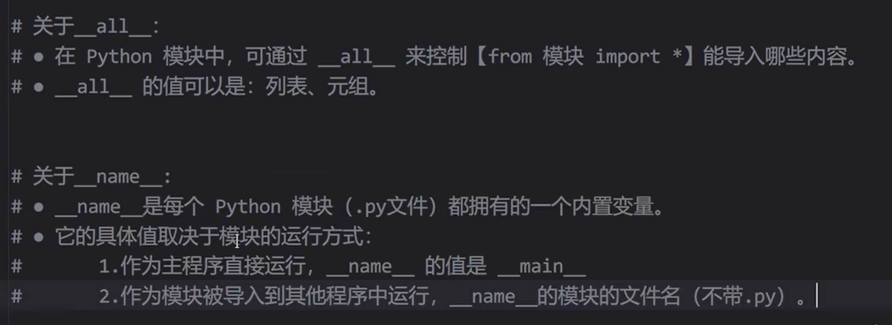
## 文件操作

### 读取
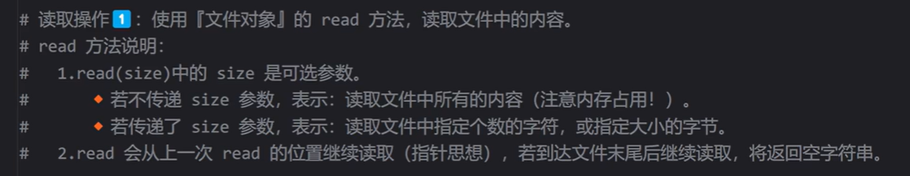
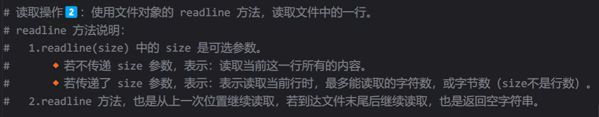
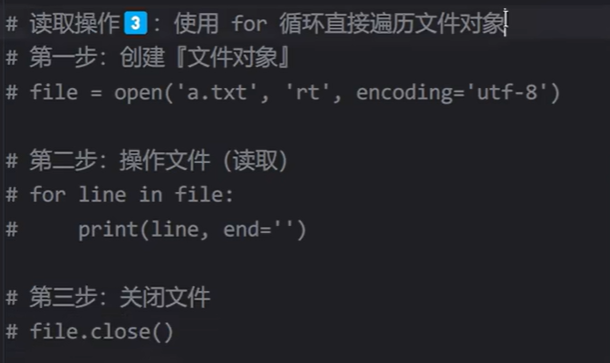
使用with  不用手动关闭文件

with原理
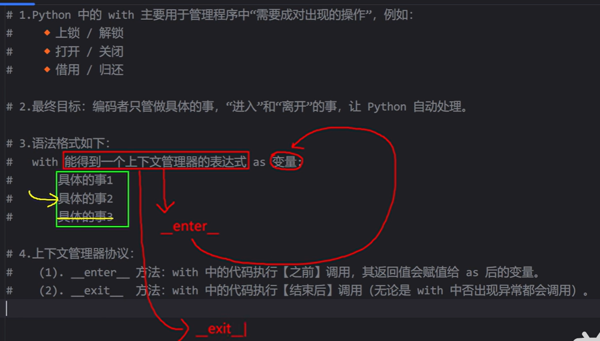
### 写入
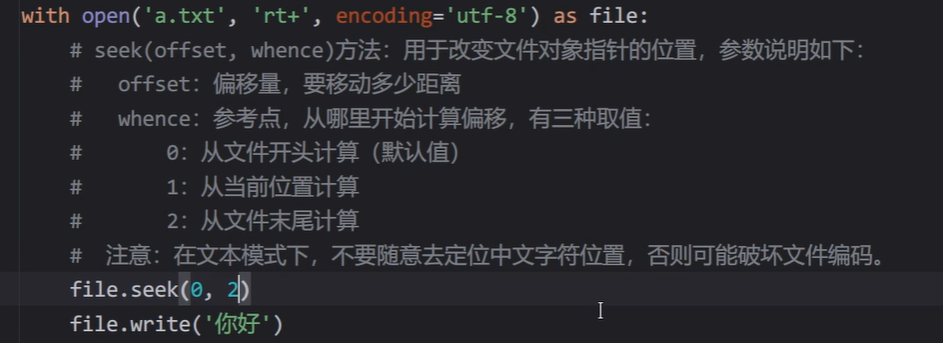
### 目录操作
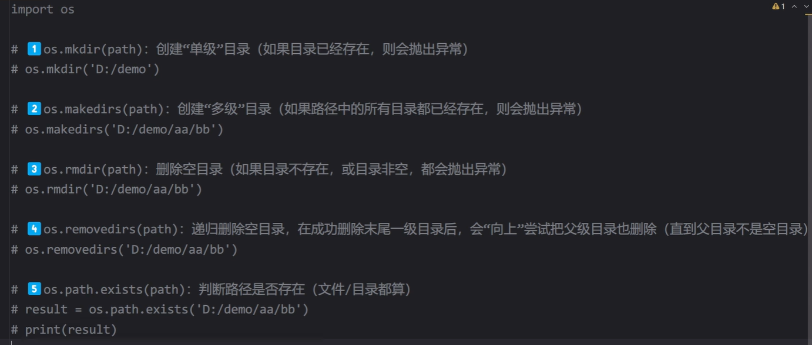
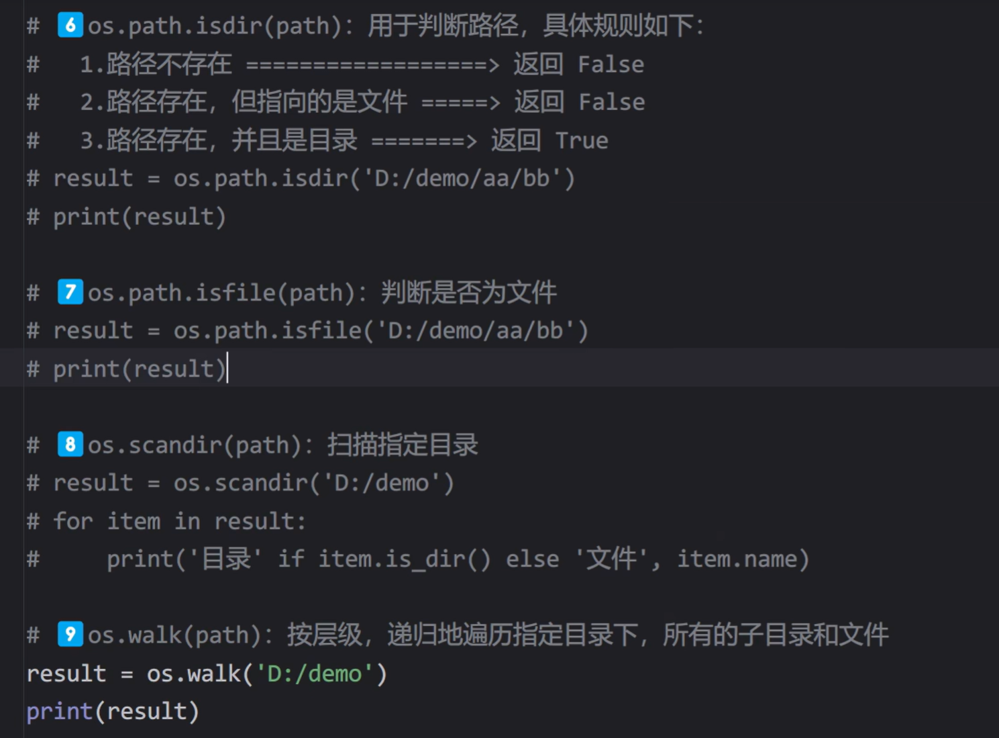
## 线程 和 进程
### 创建进程
引入包
```python
from multiprocessing import Process
```
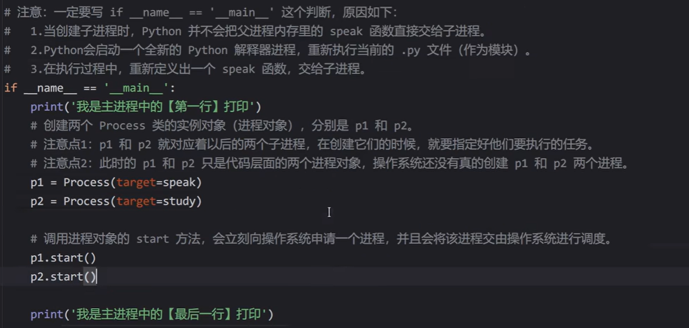
```python 
from multiprocessing import Process  

def process1():  
    num = 1000  
    for i in range(1,num+1):  
        print(f"我是process1 进程,正在执行第 {i} 件事情")  
  
def process2():  
    num = 1000  
    for i in range(1,num+1):  
        print(f"我是process2 进程,正在执行第 {i} 件事情")  
  
if __name__ == "__main__":  
    num = 100000  
    print("开始创建进程")  
    p1 = Process(target=process1)  
    p2 = Process(target=process2)  
    p1.start()  
    p2.start()  
    print("结束运行")
```

```python
import os  
from multiprocessing import Process  
  
  
  
def process1(n):  
    num = 100  
    for i in range(1,num+1):  
        print(f"我是process1 进程,正在执行第 {i} 件事情: n:{n}")  
        print(f"当前进程是 {os.getpid()}, 父进程是 {os.getppid()}")  
  
def process2(n,j):  
    num = 100  
    for i in range(1,num+1):  
        print(f"我是process2 进程,正在执行第 {i} 件事情 n:{n} j:{j}")  
        print(f"当前进程是 {os.getpid()}, 父进程是 {os.getppid()}")  
  
if __name__ == "__main__":  
    num = 10  
    print(f"开始创建进程,主进程是 {os.getpid()}")  
    p1 = Process(target=process1,args=(10,))  
    p2 = Process(target=process2,args=(20,30))  
    p1.start()  
    p2.start()  
    print("结束运行")
```
### 锁

```python
import os  
from multiprocessing import Process,Lock,RLock  
  
  
  
def process1(lock):  
    num = 100  
    for i in range(1,num+1):  
        lock.acquire() #上锁，Rlock会记录层数，lock锁二次上锁会变成死锁  
        lock.acquire()  
        print(f"我是process1 进程,正在执行第 {i} 件事情:")  
        lock.release()  
        print(f"当前进程是 {os.getpid()}, 父进程是 {os.getppid()}")  
        lock.release() #释放锁  
  
def process2(lock,n,j):  
    num = 100  
    for i in range(1,num+1):  
        with lock: #自动释放锁  
            print(f"我是process2 进程,正在执行第 {i} 件事情 n:{n} j:{j}")  
            print(f"当前进程是 {os.getpid()}, 父进程是 {os.getppid()}")  
  
if __name__ == "__main__":  
    print(f"开始创建进程,主进程是 {os.getpid()}")  
    # lock = Lock()  
    lock = RLock()  
    p1 = Process(target=process1,args=(lock,))  
    p2 = Process(target=process2,args=(lock,20,30))  
    p1.start()  
    p2.start()  
    print("结束运行")
```
### join
join (等待时间) 
```
if __name__ == "__main__":  
    print(f"开始创建进程,主进程是 {os.getpid()}")  
    p1 = Process(target=process1,args=(lock,))  
    p2 = Process(target=process2,args=(lock,20,30))  
    p1.start()  
    p2.start()  
    p1.join() #代码所在的进程等P1进程结束后执行
    p2.join()
    print("结束运行")
```


