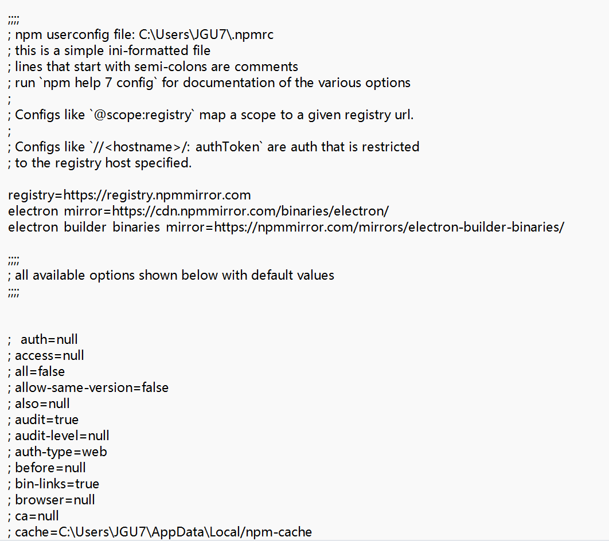

#electron 
## 原生html方式

### 1. 创建文件夹并初始化
```sh
npm init
```
修改package.json,author，description
```json
{  
  "name": "wsjy",  
  "version": "1.0.0",  
  "description": "WSJY DOWNLOAD",  
  "main": "main.js",  
  "scripts": {  
    "test": "echo \"Error: no test specified\" && exit 1"  },  
  "author": "BG",  
  "license": "ISC",  
  "devDependencies": {  
    "electron": "^40.6.1"  
  }  
}
```

### 2. 安装electron
#安装electron
```sh
npm install electron --save-dev
```
淘宝镜像源安装失败方法
先执行
```sh
npm config edit
```
修改弹出的配置文件.npmrc
```
registry=https://registry.npmmirror.com
electron_mirror=https://cdn.npmmirror.com/binaries/electron/
electron_builder_binaries_mirror=https://npmmirror.com/mirrors/electron-builder-binaries/
```
如图

删除你项目的node_modules文件夹
重启cmd命令行工具（vscode或者其他ide也要重启一下，更稳妥）
执行下面命令清除npm的缓存
```sh
npm cache clean --force
```
问题已经解决了，再执行命令安装electron试试
```sh
npm install electron --save-dev
```
> 参考：[electron安装报错终极解决办法\_npm install electron报错-CSDN博客](https://blog.csdn.net/oNuoZuo/article/details/140712310?spm=1001.2014.3001.5502)

### 3.package.json添加start
package.json
```json
{  
  "name": "wsjy",  
  "version": "1.0.0",  
  "description": "WSJY DOWNLOAD",  
  "main": "main.js",  
  "scripts": {  
    "start": "electron .",  
    "test": "echo \"Error: no test specified\" && exit 1"  },  
  "author": "BG",  
  "license": "ISC",  
  "devDependencies": {  
    "electron": "^40.6.1"  
  }  
}
```
### 4.创建main.js文件

