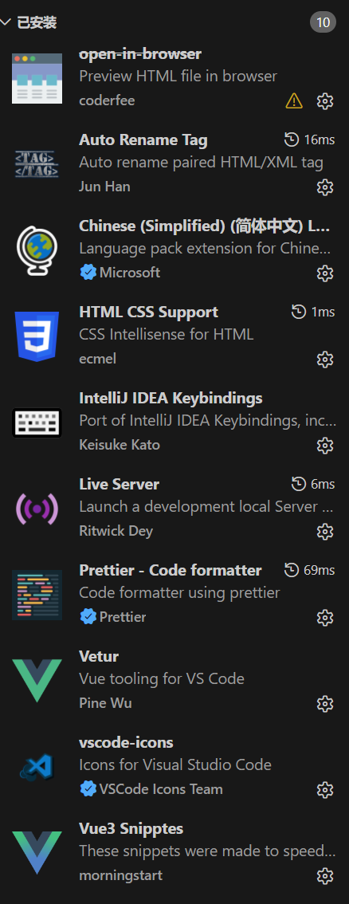

#vscode #js 

## 下载安装

> 官网下载： [Visual Studio Code - The open source AI code editor](https://code.visualstudio.com/)

## 插件使用安装
### Chinese (Simplified) (简体中文) Language Pack for Visual Studio Code
中文语言包

### Auto Rename Tag自动修改标签对插件
### HTML CSS Support HTML CSS支持
### Intellj IDEA Keybindings IDEA快捷键支持
### Live Server实时加载功能的小型服务器
### openin browser通过浏览器打开当前文件的插件
### Prettier-Code formatter代码美化格式化插件
### Vetur VScode中的Vue工具插件
### vscode-icons文件显示图标插件
### Vue 3 snipptes 生成VUE模板插件
### Vue language Features Vue3语言征插件 （改名Vue (Official)）

### CSS Peek 
VSCode 插件 ‌**CSS Peek**‌ 的主要作用是‌**在前端开发中，快速从 HTML、Vue、React 等模板文件中的类名（class）或 ID，跳转到其对应的 CSS、SCSS、Less 等样式文件中的定义位置**‌，从而大幅提升样式查找和调试效率。
### ESLint 
VSCode 插件 ESLint 的主要作用是‌**在编码过程中实时检测 JavaScript 和 TypeScript 代码中的潜在错误、代码风格违规以及不安全的编程模式，并提供自动修复建议**‌，从而提升代码质量和团队协作效率。

