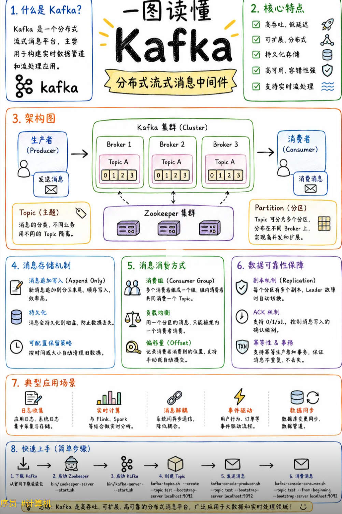
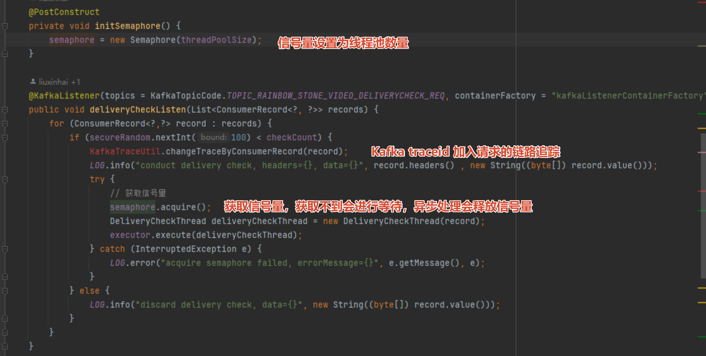
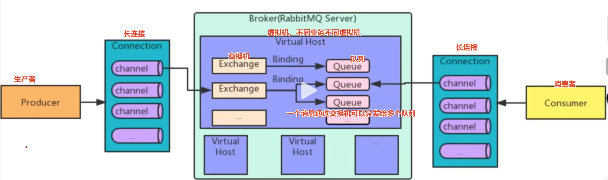
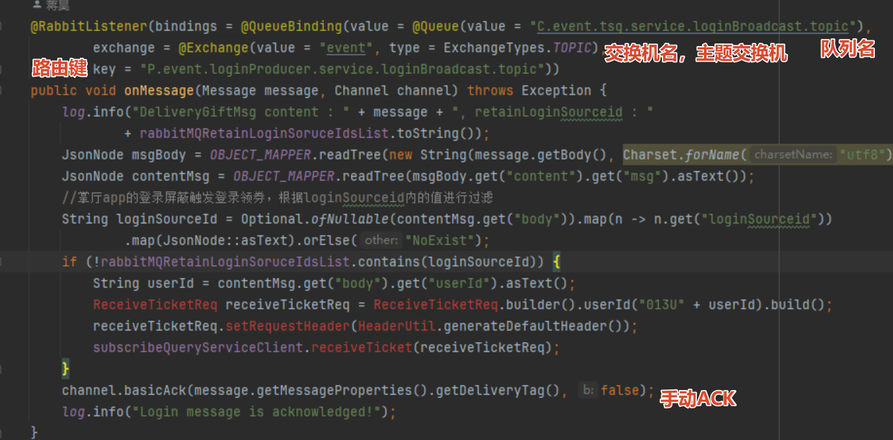
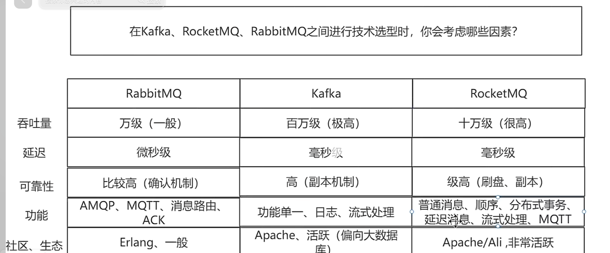

掌握JAVA核心知识，熟悉 JVM、多线程、并发编程、线程池、锁机制、常见设计模式
熟悉微服务架构，掌握 Spring Boot、Spring Cloud， mybatis框架，具备服务治理、容灾、幂等、限流降级、链路追踪等实践经验
熟悉 Redis、Kafka、MySQL、mycat、rabbitMQ 等中间件，具备缓存设计、消息异步解耦、慢 SQL 优化、查询优化和高并发调优经验 //todo 拆一下
熟悉Linux环境和常用的Shell命令，能熟练使用idea、Git、maven、jmeter等开发测试工具
熟练掌握常用RPC协议、缓存、JVM调优、分布式队列、数据同步、分布式事务、分布式 ID 生成、分布式锁
了解 HTML、CSS、JavaScrip、vue前端相关技术
熟悉Python基本语法，曾独立借助ai开发过视频爬虫下载

分布式事务、分布式 ID 生成、分布式锁、服务治理、链路追踪

kafka消息一致性问题

rabbitmq消息一致性问题

消息异步解耦： 异步发送请求，做异步业务，不影响主流程

面试问题
### 线程污染问题，threadloacal 实现的线程上下文，没remove直接获取，导致数据重新问题

## 消息中间件
### Kafka原理图

#### rebalence
加消费者时会出现rebalence，所有消费者停止消费
大量消息积压时，解决方法，1.加消费者，消费者不能超过分区数 一个分区只能对应一个消费者多了也是浪费 2. 检查消息积压原因，是不是消费超时，尤其网络超时之类可以，可以监控，把拉消息和处理消息分开，让线程池去做处理消息

#### 公司Kafka做法

Kafka配置：
key,value 序列化 
是否自动创建topic
retries 副本数量
batch-size， 批量拉取消息大小
acks, 0 发出即 成功，1 发到leader 成功， -1/all 发到leader 和所有副本 才算成功
批量发送的数据大小 和 缓冲池大小

### rabbitMQ原理图

交换机（Exchange）：交换机是消息的分发中心，负责将接收到的消息路由到一个或多个队列。它定义了消息的传递规则，可以根据规则将消息发送到一个或多个队列。
直连交换机（Direct Exchange）：将消息路由到与消息中的路由键（RoutingKey）完全匹配的队列。
主题交换机（Topic Exchange）：根据通配符匹配路由键，将消息路由到一个或多个队列。
扇出交换机（Fanout Exchange）：将消息广播到所有与交换机绑定的队列，忽略路由键。
头部交换机（Headers Exchange）：根据消息头中的属性进行匹配，将消息路由到与消息头匹配的队列。（不常用）
#### AMQP协议
AMQP不同于简单的Socket通信，它构建了一套规范化的流转模型，其核心流程可归纳为：

- **Producer（生产者）**：将业务数据封装为Message，附带Routing Key投递至Exchange。
- **Exchange（交换器）**：根据Binding规则,将消息精准路由至目标Queue。
- **Queue（队列）**：消息的物理存储载体,提供持久化与内存双模式。
- **Consumer（消费者）**：订阅Queue并ACK确认,确保消息至少被消费一次。
#### 死信队列
条件:
消息消费超时
队列满了，消息入死信队列
消息被拒绝，并且不能入队列

#### 公司代码

### rabbitMQ集群
broker 中的exchange存所有队列消息，queue（主从模式）分发复制给所有副本，自带分布式通信，如果不通，可能存在脑裂（自认为自己是主节点，实际上自己网络不通），解决方式，采用选举机制

### 总结

重复消费问题

rabbitMQ 手动ACK，然后保证幂等，或者重复消费也不影响业务（如订单状态更新设置的状态变化，或者有补偿机制），或者使用消息幂等表，设置消息消费的状态，如果消费失败，重新发起到队列消费

## nosql
### redis
#### 缓存穿透

## 多线程
### 核心线程数计算公式

> cpu 密集型特征:没有外部调用，纯内存计算，cpu使用率接近百分之百，增加线程数不会提升吞吐量，反而增加上下文切换。
> io 密集型特征:有数据库、redis、http文件等 io 操作，cpu 使用率不高大部分时间线程在等待，增加线程数可以提升吞吐量但有上限。实战判断方法:用 arthas 或 jprofile 查看线程状态，统计 waiting 和timedwaiting 的比例
> 压测时观察 cpu使用率。推如果cpu 很低而 qps上不去，说明io是瓶颈。

1.cpu密集型任务线程数等于 cpu 核心数加1，为什么加 1?因为当某个线程因cpu资源缺失或其他原因堵塞时，额外的这个线程可以顶上去，保证 cpu 不闲置。
2.io 密集型任务线程数等于 cpu 核心数乘2，为什么乘 2?因为io 密集型的线程大部分时间在等待io，cpu 经常空闲，可以开更多线程来利用 cpu

### 线程几种状态
NEW, // 新建 
RUNNABLE, // 可运行 
BLOCKED, // 阻塞
WAITING, // 无限期等待
TIMED_WAITING, // 限期等待 
TERMINATED // 终止

## spring
spring 三级缓存
一级缓存缓存实例化并初始化成功的bean
二级缓存缓存半成品，只初始化的对象
三级缓存缓存objectFactory bean工厂，内部有getObject方法，判断对象是否需要aop代理，需要代理返回代理对象，不需要代理返回半成品对象给二级缓存

