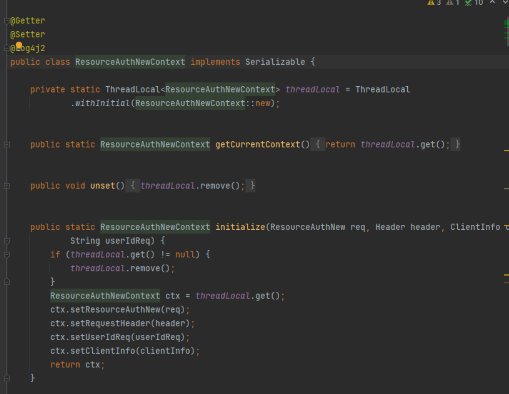

掌握JAVA核心知识，熟悉 JVM、多线程、并发编程、线程池、锁机制、常见设计模式
熟悉微服务架构，掌握 Spring Boot、Spring Cloud， mybatis框架，具备服务治理、容灾、幂等、限流降级、链路追踪等实践经验
熟悉 Redis、Kafka、MySQL、mycat、rabbitMQ 等中间件，具备缓存设计、消息解耦、慢 SQL 优化、查询优化和高并发调优经验
熟悉Linux环境和常用的Shell命令，能熟练使用idea、Git、maven、jmeter等开发测试工具
熟练掌握常用RPC协议、缓存、JVM调优、分布式队列、数据同步、分布式事务、分布式 ID 生成、分布式锁
了解 HTML、CSS、JavaScrip、vue前端相关技术
熟悉Python基本语法，曾独立借助ai开发过视频爬虫下载

分布式事务、分布式 ID 生成、分布式锁、服务治理、链路追踪

kafka消息一致性问题

rabbitmq消息一致性问题

线程污染问题，threadloacal 实现的线程上下文，没remove直接获取，导致数据重新问题
